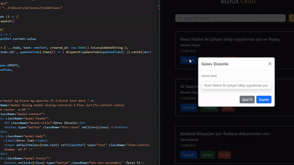

# Redux Todo CRUD Uygulaması

- Bu proje, Redux, json-server, axios ve react-toastify teknolojilerini kullanarak bir Todo uygulaması geliştirmek için yapılmıştır.Redux'ın davranışlarını anlamak ve state yönetiminde bize sağladığı kolaylıkları özetlemek için tasarlanmıştır
## Kullanılan Teknolojiler

- Redux: State  yönetimi için kullanılmıştır.
- json-server: Basit bir JSON sunucusu sağlar, bu uygulamada verileri yönetmek için kullanılmıştır.
- axios: HTTP istekleri göndermek için kullanılmıştır.
- react-toastify: Kullanıcıya bildirimler göstermek için kullanılmıştır.

# Neden Context yerine Redux ?
- Kod tekrarını önler
- Permansı daha iyi
- Bileşen içerismdeki karışıklığı azaltır
- Hata ayıklama daha kolaydır
- Orta ve büyük ölçekli projelerde state yönetmini daha kolay hale getirir

# Ekran Görüntüsü

# Redux ile ilgili bilinmesi gerekenler
1. Store: Uygulamanın bütün bileşenleri tarafında erişlebilen ve yönetilebilen state deposu

1. Reducer: Akisyondan aldığı talimata göre store'da tutulan state'in nasıl değişceğine karar veren fonksiyon

3. Action: Store'daki state'i güncellemek için reduce'a gönderdiğimiz nesne. (emir | haber | eylem)

- Action iki değere bir nesnedir:
- type (zorunlu): Action'ın görevini tanımlayan string
- payload (opsiyonel): Action'ın verisi

4. Dispatch (Sevketmek): Action'un gerçekleştiğ'ini reducer'a haber veren method

5. Subscribe (Abone Olmak): Bileşen'leirn store'da tutalan veriye erişimini sağlaması. (useContext,useSelector)

6. Provider (Sağlayıcı): Store'da tutuylan veileri uygulamaya sağlar.
